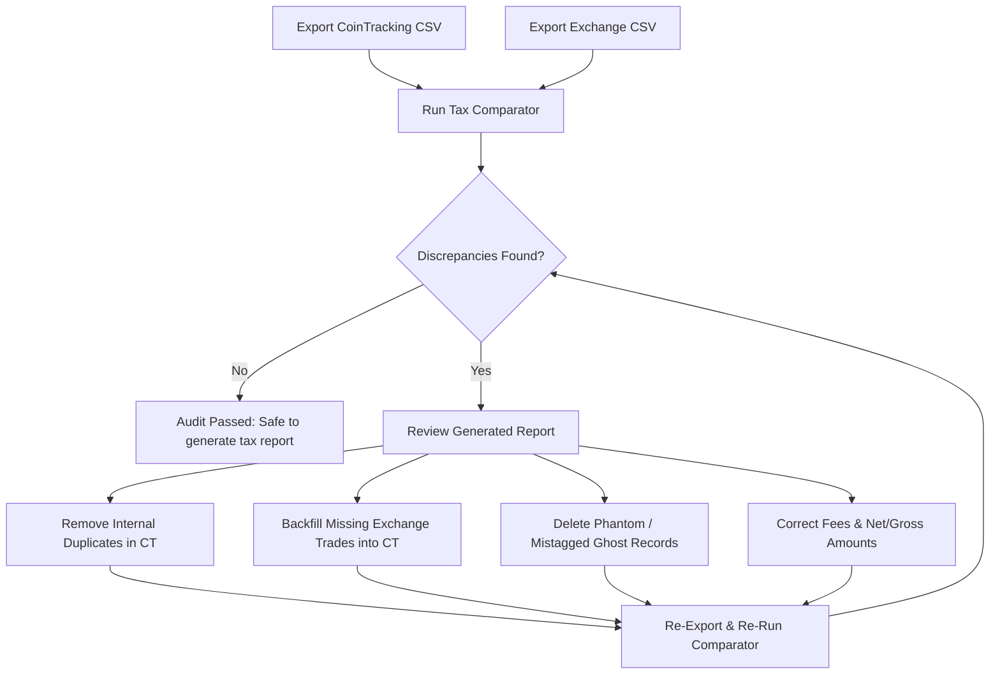

# Cryptocurrency Tax Reconciliation & Discrepancy Guide

This guide explains the mechanics of reconciling cryptocurrency records between portfolio trackers (such as CoinTracking) and raw exchange reports, why inconsistencies occur, and actionable steps to resolve every category of discrepancy flagged by this utility.

---

## 1. Why Reconciliation is Essential for Tax Filings

Cryptocurrency transactions are treated as property by the IRS (Notice 2014-21) and most global tax authorities. Every trade, crypto-to-crypto swap, or spending event is a taxable disposal that requires calculating:

$$\text{Capital Gain / Loss} = \text{Proceeds (Fair Market Value)} - \text{Adjusted Cost Basis} - \text{Allowable Fees}$$

### The Risk of Unreconciled Records:
1. **Double Counting (Duplicates)**: If an exchange trade is imported twice (e.g., once via an automated API sync and once via an end-of-year CSV batch upload), the cost basis or disposal is duplicated. This creates phantom capital gains or inflates portfolio holdings.
2. **Missing Transactions**: Missing a buy transaction results in a **zero cost basis** for future disposals, which artificially increases the taxable capital gain.
3. **Omitted Fees**: Trading fees reduce capital gains or increase capital losses. If fees are omitted from CoinTracking, taxpayers end up overpaying taxes.
4. **Timezone Mismatches**: Transactions recorded under different dates due to timezone discrepancies can alter the holding period classification (short-term vs. long-term capital gains) or mismatch IRS Form 1099-DA / 1099-B matching.

---

## 2. Common Causes of Inconsistencies

### 2.1 API Sync vs. CSV Import Collisions
- **The Issue**: Many users set up an automatic API sync in CoinTracking, but later upload a CSV to cover older history or missing assets.
- **The Result**: Overlapping dates cause duplicate transactions. CoinTracking attempts deduplication based on transaction IDs, but if the API and CSV exports use different ID schemas (or if the CSV lacks Trade IDs), duplicates are created.

### 2.2 Timezone Drift & Systematic Offsets
- **The Issue**: Exchange exports usually record timestamps in **UTC** (Coordinated Universal Time). However, CoinTracking account settings often format exports in the user's **local timezone** (e.g., Eastern Daylight Time `UTC-4`, Eastern Standard Time `UTC-5`, Pacific Standard Time `UTC-8`).
- **The Result**: A trade that took place on `2021-05-10 14:23:05 UTC` might appear in CoinTracking as `2021-05-10 10:23:05 EDT`.
- **How Tax Comparator Handles This**: The comparator automatically tests for integer-hour differences ($\pm 1$ to $\pm 14$ hours). If the financial values and minutes/seconds align, it matches the pair and flags a `TIMEZONE_OFFSET` warning.

### 2.3 Fee Accounting & Deductions
- **The Issue**: Some CSV formats report the *net proceeds* (total after deducting fees), while others report *gross subtotal* and list fees in a separate column.
- **The Result**:
  - CoinTracking may log the fee as `0.00` if the CSV column was missed during import.
  - The fee currency may be misidentified (e.g., fee paid in ETH vs fiat USD).

### 2.4 Partial Fills vs. Aggregated Orders
- **The Issue**: A single limit order for $1.0\text{ BTC}$ might be filled by an exchange in 4 partial fills (e.g., $0.1, 0.4, 0.25, 0.25\text{ BTC}$).
- **The Result**:
  - Coinbase Pro / Gemini ActiveTrader exports each individual fill row.
  - A summary CSV or manual entry might record a single consolidated $1.0\text{ BTC}$ row.

---

## 3. Discrepancy Types & Resolution Workflows

When you run `tax_comparator`, the generated report categorizes issues into distinct discrepancy types. Follow the workflows below to resolve each one:

### 3.1 `INTERNAL_DUPLICATE_COINTRACKING`
- **Severity**: **HIGH**
- **Symptom**: Two or more rows in CoinTracking have the same order ID or identical financial legs and timestamps.
- **Resolution Workflow**:
  1. Open CoinTracking $\rightarrow$ **Trade Table**.
  2. Search for the date or asset specified in the report.
  3. Inspect the duplicate entries:
     - Check the **Comment** column to see if one was created by "API Job" and another by "CSV Import".
  4. Delete the duplicate entry (retain the one that has the official Trade ID or complete fee details).

### 3.2 `MISSING_IN_COINTRACKING`
- **Severity**: **HIGH**
- **Symptom**: An execution exists in the exchange CSV that does not appear anywhere in CoinTracking.
- **Resolution Workflow**:
  1. Review the details in the `Missing in CoinTracking` section of the report (exchange line number, timestamp, assets, amounts).
  2. Check if the transaction belongs to an asset or product you intentionally excluded, or if the API sync failed for that date range.
  3. In CoinTracking, click **Enter Coins** $\rightarrow$ **New Entry** (or re-import the missing date range).
  4. Record the exact timestamp (UTC), buy amount, sell amount, fee, and exchange Trade ID.

### 3.3 `MISSING_IN_EXCHANGE` (Ghost Records)
- **Severity**: **HIGH**
- **Symptom**: A transaction in CoinTracking is tagged with this exchange, but the exchange report has no record of it.
- **Resolution Workflow**:
  1. Check the CoinTracking line number reported.
  2. Determine if the exchange name was mistagged (e.g., tagged as `Coinbase` when it was actually executed on `Coinbase Pro` or `Gemini`).
  3. Check if the entry was a cancelled order or a test transaction that was manually entered by mistake.
  4. If invalid, delete the ghost entry from CoinTracking to prevent false capital losses/gains.

### 3.4 `FEE_MISMATCH`
- **Severity**: **MEDIUM / LOW**
- **Symptom**: The exchange recorded a fee (e.g. `$15.00 USD`), but CoinTracking logged `0` fee or an incorrect currency.
- **Resolution Workflow**:
  1. Locate the transaction in CoinTracking via its date or Trade ID.
  2. Click **Edit**.
  3. Add the missing fee amount and select the correct fee currency as shown in the exchange report.
  4. Save the entry to ensure the fee is properly deducted against your capital gains.

### 3.5 `TIMEZONE_OFFSET`
- **Severity**: **MEDIUM**
- **Symptom**: The transaction matched on financial amounts and order ID, but the timestamp differs by an exact number of hours (e.g. $+4\text{ hours}$ or $+5\text{ hours}$).
- **Resolution Workflow**:
  1. Verify your CoinTracking account timezone settings under **Account** $\rightarrow$ **Settings** $\rightarrow$ **Time Zone**.
  2. For consistent tax auditing, it is recommended to set CoinTracking's display and import timezone to **UTC**, aligning with exchange standards and blockchain block timestamps.

### 3.6 `AMOUNT_MISMATCH`
- **Severity**: **HIGH**
- **Symptom**: The matched transaction has different numerical quantities (e.g., $1.498\text{ ETH}$ vs $1.500\text{ ETH}$).
- **Resolution Workflow**:
  1. Check if the exchange deducted a fee directly from the received asset (net proceeds) while CoinTracking recorded the gross amount without fee adjustment.
  2. Update the CoinTracking record with the exact gross amount and assign the difference to the **Fee** field.

---

## 4. Reconciliation Workflow Summary

